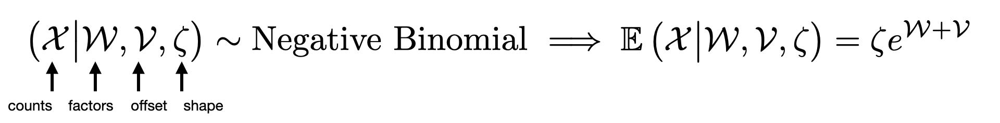
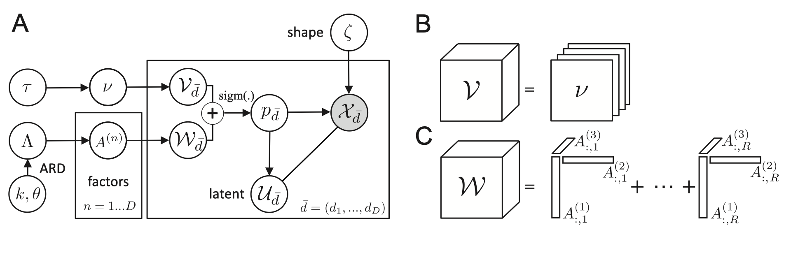
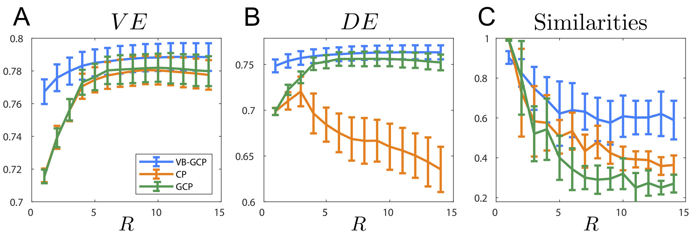

# Probabilistic Tensor Decomposition of Neural Population Spiking Activity


[license-img]: https://img.shields.io/badge/license-MIT-green
[license-url]: https://github.com/hugosou/vbgcp/blob/main/LICENSE.md

[python-img]:https://img.shields.io/badge/python-v3.8-blue
[python-url]: https://github.com/hugosou/vbgcp/tree/main/python

[matlab-img]:https://img.shields.io/badge/matlab-R2020-orange
[matlab-url]: https://github.com/hugosou/vbgcp/tree/main/matlab

[![][license-img]][license-url] [![][matlab-img]][matlab-url] 

[Matlab][matlab-url] (recommended) and [Python][python-url] (in developement) implementations of [Soulat et al. (2021)](https://arxiv.org/abs/2030.12345).



The model (A) decomposes an observed count tensor (eg. binned spikes) using a Negative Binomial distribution that depends on a shape parameter, a constrained offset (B) and low rank tensor (C). 
Variational inference is implemented using a Pólya-Gamma augmentation scheme. 




## Demo

To train the model(s) on the toydataset described in the paper open:

```
matlab/demo_tensor_variational_inference.m
```
Or:
```
python/examples/demo_tensor_variational_inference.ipynb
```
PG approximation Figures can be generated with: 

```
matlab/study_polyagamma.m
```

## Data Analysis

We process results from  S.Keshavarzi (2021) https://doi.org/10.1101/2021.01.22.427789 and benchmark performance of our method compared to standard (G)CP baselines in terms of Variance Explained (A)  Deviance Explained (B) and a robustness/similarity metric (C)



Figure generated using:
```
matlab/data_benchmark.m
matlab/data_benchmark_process.m
```


