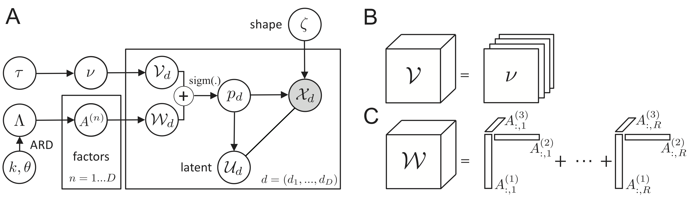
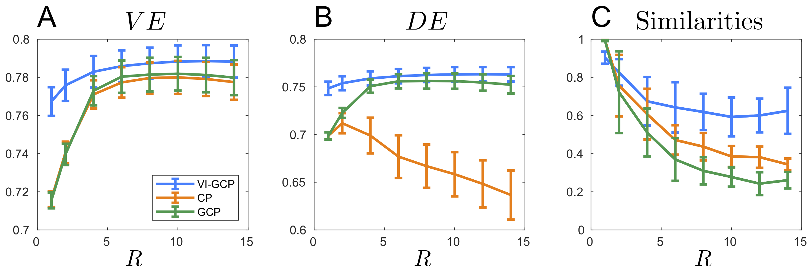

[![][license-img]][license-url]

[license-img]: https://img.shields.io/github/license/mashape/apistatus.svg
[license-url]: https://github.com/ahwillia/tensortools/blob/master/LICENSE.md

# Probabilistic Tensor Decomposition of Neural Population Spiking Activity

Implementation of [Bayesian tensor decomposition of population neural spike trains](https://arxiv.org/abs/2030.12345). (A) Graphical model. (B) The Offset tensor $\mathcal{V}$ is constrained to vary along a limited set of dimensions. (C) $\mathcal{W}$ is a low rank tensor.



## Requirements
- MATLAB R2020a

- Laurent S (2021). Khatri-Rao product (https://www.mathworks.com/matlabcentral/fileexchange/28872-khatri-rao-product), MATLAB Central File Exchange. Retrieved May 28, 2021. 

- MunkRes:  Yi Cao (2021). Munkres Assignment Algorithm (https://www.mathworks.com/matlabcentral/fileexchange/20328-munkres-assignment-algorithm), MATLAB Central File Exchange. Retrieved May 28, 2021. 

- (G)CP baselines
Brett W. Bader, Tamara G. Kolda and others. MATLAB Tensor Toolbox Version 2.6, Available online, February 2015. URL: http://www.sandia.gov/~tgkolda/TensorToolbox/.  GCP uses default optimization method is L-BFGS-B: https://github.com/stephenbeckr/L-BFGS-B-C

## Demo

To train the model(s) on the toydataset described in the paper, run:

```
demo_tensor_variational_inference.m
```
PG approximation Figures can be generated with: 

```
study_polyagamma.m
```

## Data Analysis

We process results from  S.Keshavarzi (2021) https://doi.org/10.1101/2021.01.22.427789 and benchmark performance of our method compared to standard (G)CP baselines in terms of Variance Explained (A)  Deviance Explained (B) and a robustness/similarity metric (C)



Figure generated using:
```
data_benchmark.m
data_benchmark_process.m
```

